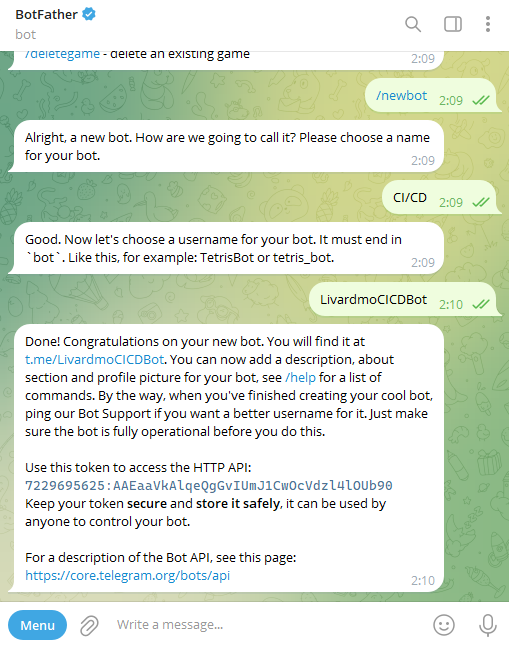

# Basic CI/CD

### Part 1. Настройка **gitlab-runner**

**== Задание ==**

##### Подними виртуальную машину *Ubuntu Server 22.04 LTS*.
##### Скачай и установи на виртуальную машину **gitlab-runner**.
##### Запусти **gitlab-runner** и зарегистрируй его для использования в текущем проекте (*DO6_CICD*).

* Разворачиваем виртуальную машину, загружаем пакет и устанавливаем

* Регистрируем

### Part 2-5

* Части со второй по пятую в отчет не включаю ввиду того что их выполнение отображено в пайплайнах

### Part 6. Дополнительно. Уведомления

**== Задание ==**

##### Настрой уведомления о успешном/неуспешном выполнении пайплайна через бота с именем «[твой nickname] DO6 CI/CD» в *Telegram*.

* С помощью BotFather создаем бота:

* После написания скрипта и редактирования .gitlab-ci.yml получаем результат:

